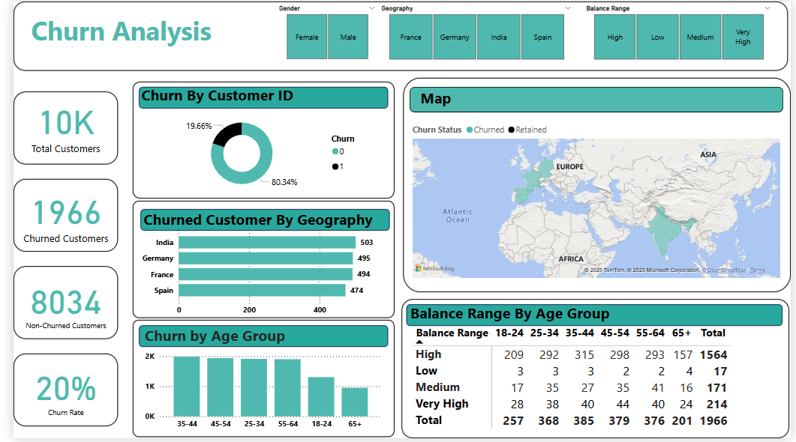

# Bank Customer Churn & Financial Health Dashboard

This Power BI project analyzes customer behavior, financial activity, and churn trends for a fictional bank. It presents actionable insights through interactive visuals, KPIs, slicers, and maps — making it a strong showcase for business intelligence and data analysis skills.

---

## 📊 Dashboard Sections

- Customer Overview
- Transaction Insights
- Churn Analysis
- Product Usage

---

## 🛠 Tools Used

- Power BI
- DAX
- Excel

---

## 📸 Dashboard Preview

---

## 🙋‍♂️ Author

**Pritam Arjun Ghorpade**  
[LinkedIn](https://www.linkedin.com/in/pritam-arjun-ghorpade)
